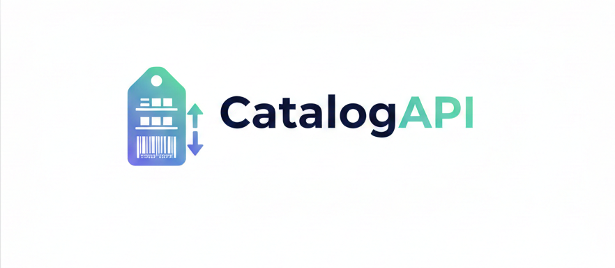
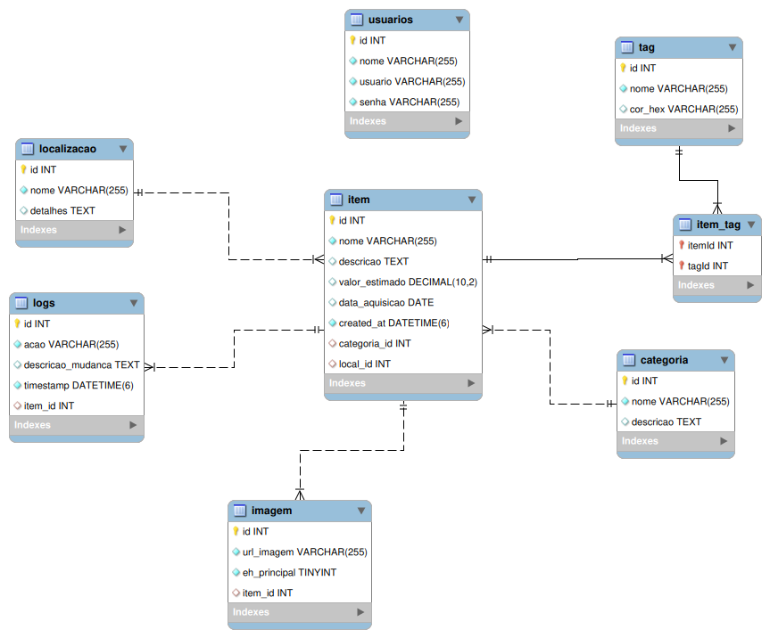

<p align="center">
  
</p>

Sistema de catalogação e inventário de objetos desenvolvido com NestJS e MySQL

## 📌 Índice

- [📋 Sobre o Projeto](#sobre-o-projeto)
- [🛠️ Tecnologias Utilizadas](#tecnologias-utilizadas)
- [📦 Pré-requisitos e Instalação](#pre-requisitos-e-instalacao)
- [▶️ Como Executar o Projeto](#como-executar-o-projeto)
- [📁 Estrutura do Projeto](#estrutura-do-projeto)
- [🗄️ Modelo de Dados](#modelo-de-dados)
- [📝 Funcionalidades Implementadas](#funcionalidades-implementadas)
- [📌 Possíveis Melhorias Futuras](#possiveis-melhorias)

<!-- - [📝 Acessar a Aplicação](#acessar-a-aplicacao)
- [🧪 Testando a Aplicação](#testando-a-aplicacao)
- [⚠️ Problemas Conhecidos e Soluções](#problemas-conhecidos)
- [📜 Scripts SQL](#scripts) -->


## <a id="sobre-o-projeto"></a> 📋 Sobre o Projeto
<div align="justify">
A CatalogAPI é uma solução para gestão de inventário e catalogação de ativos, desenvolvida para resolver a dificuldade de rastrear a localização e o estado de objetos em ambientes corporativos ou pessoais. O projeto oferece uma estrutura robusta para organizar itens através de categorias, tags e localizações físicas específicas, garantindo que o paradeiro de cada objeto seja conhecido. Além do controle de estoque, a API foca em segurança e transparência, implementando autenticação JWT e um sistema de auditoria imutável que registra cada alteração realizada nos itens.
</div>

## <a id="tecnologias-utilizadas"></a> 🛠️ Tecnologias Utilizadas

### Core
- **Node.js** - Ambiente de execução que permite rodar JavaScript no lado do servidor.

- **TypeScript** - Superconjunto de JavaScript que adiciona tipagem estática e recursos avançados ao desenvolvimento.

- **NestJS** - Framework progressivo para Node.js, focado em arquitetura modular, escalabilidade e facilidade de manutenção.

### Banco de Dados
- **TypeORM** - ORM (Object-Relational Mapper) para persistência e mapeamento de dados entre o código e o banco.

- **MySQL** - Banco de dados relacional utilizado para armazenamento dos dados em produção.

- **SQLite** - Banco de dados em memória utilizado para agilizar a execução de testes automatizados.

### Segurança

- **JWT (JSON Web Token)** - Padrão utilizado para a criação de tokens de acesso seguros para autenticação de usuários.

- **Passport** - Middleware de autenticação modular para Node.js, facilitando a implementação da estratégia JWT.

- **Bcrypt** - Biblioteca utilizada para a criptografia e hashing de senhas, garantindo a segurança dos dados sensíveis.

### Utilitários
- **Swagger (OpenAPI)** - Ferramenta para documentação interativa da API, permitindo testar os endpoints diretamente pelo navegador.

- **class-validator** - Utilizado para a validação de dados de entrada (DTOs) através de decorators, garantindo a integridade dos dados.

- **Jest** - Framework de testes em JavaScript com foco na simplicidade, utilizado para garantir a qualidade do código através de testes unitários.

### IDE e Ferramentas

- **Visual Studio Code** - Ambiente de desenvolvimento principal, utilizando extensões para suporte ao TypeScript, ESLint e NestJS.
- **MySQL Workbench** - Ferramenta visual para modelagem de dados, administração do banco de dados MySQL e execução de queries SQL.
- **Insomnia** - Cliente HTTP utilizado para testar os endpoints da API, validar o envio de JSON e verificar as respostas do servidor.
- **Git** - Sistema de controle de versões utilizado para o gerenciamento de branches e histórico de commits.


## <a id="pre-requisitos-e-instalacao"></a> 📦 Pré-requisitos e Instalação

Antes de começar, você precisará ter instalado em sua máquina o **Node.js** e o **MySQL**. Este projeto foi desenvolvido utilizando o **VS Code** como IDE preferencial.

### 1. Ferramentas Necessárias

| Ferramenta | Versão | Link de Download |
| --- | --- | --- |
| **Node.js** | 18 ou superior | [nodejs.org](https://nodejs.org/) |
| **MySQL** | 8.0 ou superior | [mysql.com](https://dev.mysql.com/downloads/) |
| **VS Code** | Mais recente | [code.visualstudio.com](https://code.visualstudio.com/) |
| **Insomnia** | Mais recente | [insomnia.rest](https://insomnia.rest/) |

### 2. Configuração do Ambiente

Após instalar o Node.js, abra o seu terminal (ou o terminal do VS Code) e siga os passos abaixo:

#### **Instalar o NestJS CLI**

O NestJS CLI é necessário para gerenciar e rodar a aplicação:

```bash
npm install -g @nestjs/cli

```

#### **Configurar o Banco de Dados**

Certifique-se de que o serviço do MySQL está rodando e crie o banco de dados principal:

```sql
CREATE DATABASE db_catalog_api;

```

## <a id="como-executar-o-projeto"></a> ▶️ Como Executar o Projeto

### 1. Clonagem e Instalação

No seu terminal, clone o repositório e instale as dependências necessárias:

```bash
# Clone o repositório
git clone https://github.com/seu-usuario/catalog-api.git

# Acesse a pasta do projeto
cd catalog-api

# Instale as dependências
npm install

```

### 2. Configuração das Variáveis de Ambiente

A aplicação depende de variáveis de ambiente para se conectar ao banco e garantir a segurança.

1. Crie um arquivo chamado `.env` na raiz do projeto (copie o conteúdo do `.env.example`).
2. Preencha as credenciais do seu MySQL (`DB_HOST`, `DB_USER`, `DB_PASS`, etc.).
3. Gere uma chave secreta para o JWT com o comando abaixo e cole-a no campo `JWT_SECRET`:

```bash
node -e "console.log(require('crypto').randomBytes(32).toString('hex'))"

```

### 3. Execução da Aplicação

Com tudo configurado, inicie o servidor de desenvolvimento:

```bash
# Modo desenvolvimento com hot-reload
npm run start:dev

```

### 4. Acesso e Documentação (Swagger)

Após iniciar, a API estará disponível em `http://localhost:3000`.


## <a id="estrutura-do-projeto"></a> 📁 Estrutura do Projeto

```
CatalogAPI/
├── src/
│   ├── main.ts              # Ponto de entrada da aplicação (configurações globais e Swagger)
│   ├── app.module.ts        # Módulo raiz que centraliza e orquestra todos os outros módulos
│   ├── auth/                # Módulo de Segurança (Autenticação e Autorização)
│   │   ├── bcrypt/          # Lógica de hashing e criptografia de senhas
│   │   ├── guard/           # Guards para proteger rotas (Ex: JwtAuthGuard)
│   │   ├── strategy/        # Estratégias do Passport (Local e JWT)
│   │   └── entities/        # Entidade de login/credenciais
│   ├── usuario/             # Gestão de usuários do sistema
│   │   ├── dto/             # Regras de validação de entrada (Create/Update)
│   │   ├── entities/        # Mapeamento da tabela de usuários no banco
│   │   └── ...              # Controller e Service (Lógica de negócio de usuários)
│   ├── categoria/           # Classificação dos itens (Eletrônicos, Móveis, etc.)
│   ├── item/                # O Core da API: gestão de objetos e inventário
│   ├── localizacao/         # Identificação de onde o item está (ex: Prateleira A)
│   ├── tag/                 # Etiquetas para filtragem dinâmica e organização
│   ├── imagem/              # Gestão de arquivos e URLs de fotos dos itens
│   └── logs_/               # Auditoria: registro imutável de todas as ações no sistema
├── test/                    # Testes de integração (E2E - End-to-End)
└── README.md                # Documentação principal do projeto
```

## <a id="modelo-de-dados"></a> 🗄️ Modelo de Dados

### Diagrama Entidade e Relacionamento
<p align="center">
  
</p>

Abaixo estão detalhadas as entidades do sistema, seus tipos de dados e restrições.

### 👤 Entidade Usuário (User)
*Responsável pelo acesso e autoria das modificações no sistema.*

| Campo | Tipo | Descrição |
|-------|------|-----------|
| `id` | int | Chave primária (Gerada automaticamente) |
| `nome` | String(100) | Nome completo do usuário (obrigatório) |
| `email` | String(100) | E-mail para login (obrigatório, único) |
| `senha` | String(255) | Hash da senha (obrigatório) |

---

### 📦 Entidade Item
*O objeto central do inventário.*

| Campo | Tipo | Descrição |
|-------|------|-----------|
| `id` | int | Chave primária |
| `nome` | String(100) | Nome do item (obrigatório) |
| `descricao` | Text | Descrição detalhada do objeto |
| `valor_estimado` | Decimal(10,2) | Valor de mercado ou seguro (opcional) |
| `data_aquisicao` | LocalDate | Data em que o item foi obtido |
| `categoria_id` | Int | FK para Categoria |
| `localizacao_id` | Int | FK para Localização |

---

### 📂 Entidade Categoria
*Classificações (ex: Eletrônicos, Ferramentas).*

| Campo | Tipo | Descrição |
|-------|------|-----------|
| `id` | Int | Chave primária, auto increment |
| `nome` | String(50) | Nome da categoria (obrigatório, único) |
| `descricao` | String | Breve detalhamento sobre o propósito da categoria |
| `itens` | String | Lista de itens vinculados a esta categoria |

---

### 📍 Entidade Localização (Spot)
*Onde o item está fisicamente guardado.*

| Campo | Tipo | Descrição |
|-------|------|-----------|
| `id` | Int | Chave primária, auto increment |
| `nome` | String(100) | Nome do local (obrigatório) |
| `detalhes` | String(255) | Informações adicionais ou pontos de referência para facilitar a busca. |
| `itens` | String(255) | Lista de itens armazenados nesta localização específica |

---

### 🏷️ Entidade Tag
*Etiquetas para buscas cruzadas.*

| Campo | Tipo | Descrição |
|-------|------|-----------|
| `id` | Int | Chave primária, auto increment |
| `nome` | String(30) | Nome da tag (obrigatório, único) |
| `itens` | String | Coleção de itens que utilizam esta etiqueta |


---

### 🖼️ Entidade Imagem
*Galeria de fotos vinculada aos itens.*

| Campo | Tipo | Descrição |
|-------|------|-----------|
| `id` | int | Chave primária |
| `url_imagem` | String(500) | Link ou caminho do arquivo |
| `eh_principal` | Boolean | Define se é a foto de capa (default: false) |
| `item_id` | int | FK para o Item vinculado |

---

### 📜 Entidade Logs (Auditoria)
*Registro imutável de movimentações (RN01).*

| Campo | Tipo | Descrição |
|-------|------|-----------|
| `id` | int | Chave primária, auto increment |
| `acao` | String(50) | Tipo de operação (CREATE, UPDATE, DELETE) |
| `descricao_mudanca` | String | Tipo de operação (CREATE, UPDATE, DELETE) |
| `item_id` | int | ID do item afetado |
| `usuario_id` | int | FK para o Usuário que realizou a ação |
| `data_hora` | Date | Momento exato da alteração |
| `dados_anteriores` | JSON | Estado do objeto antes da alteração |

## <a id="funcionalidades-implementadas"></a> 📝 Funcionalidades Implementadas

### ✅ Usuário

- [x] Cadastrar novo Usuário com validação de e-mail
- [x] Consultar todos os Usuários
- [x] Consultar um Usuário por nome
- [x] Consultar um Usuário por ID
- [x] Editar dados do Usuário
- [x] Remover Usuário 

### ✅ Item

- [x] Cadastrar novo Item
- [x] Consultar todos os Itens
- [x] Consultar um Item por nome
- [x] Consultar um Item por ID
- [x] Editar dados do Item
- [x] Remover Item 

### ✅ Categoria

- [x] Cadastrar uma nova Categoria
- [x] Consultar todas as Categorias
- [x] Consultar uma Categoria por nome
- [x] Consultar uma Categoria por ID
- [x] Editar dados da Categoria
- [x] Remover Categoria 

### ✅ Localização

- [x] Cadastrar uma nova Localização
- [x] Consultar todas as Localizações
- [x] Consultar uma Localização por nome
- [x] Consultar uma Localização por ID
- [x] Editar dados da Localização
- [x] Remover Localização 

### ✅ Tag

- [x] Cadastrar uma nova Tag
- [x] Consultar todas as Tags
- [x] Consultar uma Tag por nome
- [x] Consultar uma Tag por ID
- [x] Editar dados da Tag
- [x] Remover Tag 

### ✅ Imagem

- [x] Cadastrar uma nova Imagem
- [x] Consultar todas as Imagens
- [x] Consultar uma Imagem por ID
- [x] Editar dados da Imagem
- [x] Remover Imagem 

### ✅ Logs

- [x] Consultar todos os Logs
- [x] Consultar um Log por ID
- [x] Consultar um Log por nome

<!--
## <a id="acessar-a-aplicacao"></a> Acessar a Aplicação

 ## <a id="testando-a-aplicacao"></a> 🧪 Testando a Aplicação

## <a id="problemas-conhecidos"></a> ⚠️ Problemas Conhecidos e Soluções

## <a id="scripts"></a> 📜 Scripts SQL
### Criação Manual das Tabelas (se necessário) -->

## <a id="possiveis-melhorias"></a> 📌 Possíveis Melhorias Futuras
- 🌐 **Infraestrutura e Deploy**
   - Containerização completa da aplicação com Docker Compose (API + MySQL).

- 🖥️ **Frontend**
   - Desenvolvimento de uma interface web para consumo da API.

   - Autenticação via JWT no frontend.

   - Dashboard com visão geral do inventário e métricas básicas.

- 📄 **Documentação**
   - Exemplos de requisições e respostas no Swagger para todos os endpoints.

   - Criação de um Postman/Insomnia Collection versionado no repositório.

 - 🗄️ **Modelagem de dados**
   - Criar um MER (Modelo Entidade Relacionamento)